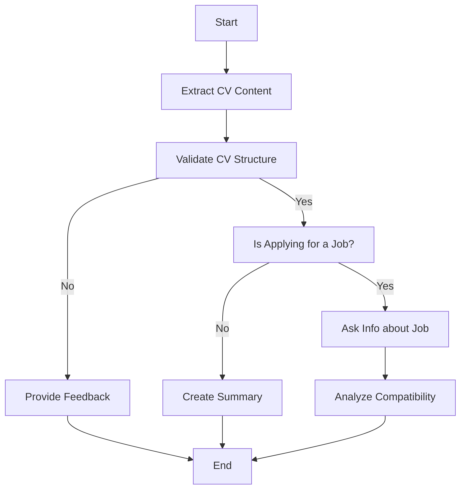

# 🔍 JobLens - AI-Powered CV Analysis & Enhancement Tool

<div align="center">


**Transform your CV with AI-powered analysis and intelligent recommendations**

</div>

## 🌟 Overview

JobLens is an intelligent CV analysis platform that leverages advanced AI technologies to provide comprehensive feedback on resumes. Using LangChain, FAISS vector databases, and state-of-the-art language models, JobLens analyzes CV structure, content quality, and job compatibility to help job seekers optimize their resumes for better career opportunities.

## ✨ Key Features

### 🎯 **Smart CV Analysis**
- **Structure Validation**: Automatically validates CV format and completeness
- **Content Quality Assessment**: Evaluates information depth and relevance
- **Professional Feedback**: Provides actionable improvement recommendations

### 🔄 **Intelligent CV Enhancement**
- **Automated Restructuring**: Reorganizes CV content for optimal presentation
- **Content Optimization**: Enhances descriptions and adds missing sections
- **Professional Formatting**: Applies industry-standard formatting guidelines

### 🎪 **Job Compatibility Analysis**
- **Skill Matching**: Compares CV skills against job requirements
- **Compatibility Scoring**: Provides percentage-based compatibility ratings
- **Gap Analysis**: Identifies missing qualifications and suggests improvements
- **Tailored Recommendations**: Offers specific advice for target positions

### 🚀 **Advanced Technology Stack**
- **Vector Search**: FAISS-powered semantic CV content retrieval
- **AI Processing**: Groq-powered language model for intelligent analysis
- **State Management**: LangGraph for complex workflow orchestration
- **Multi-format Support**: PDF, DOCX, and TXT file compatibility

## 🏗️ Architecture



## 📋 Prerequisites

Before running JobLens, ensure you have:

- **Python 3.8+** installed on your system
- **CUDA-compatible GPU** (optional, for faster embeddings)
- **Groq API Key** for language model access
- **Git** for repository cloning

## 🚀 Quick Start Guide

### 1. Clone the Repository

```bash
git clone https://github.com/iesusdavila/JobLens.git
cd JobLens
```

### 2. Set Up Python Environment

```bash
# Create virtual environment
python -m venv venv

# Activate virtual environment
# On Linux/Mac:
source venv/bin/activate
# On Windows:
# venv\Scripts\activate
```

### 3. Install Dependencies

```bash
pip install -r requirements.txt
```

### 4. Environment Configuration

Create a `.env` file in the project root:

```bash
# Create .env file
touch .env
```

Add your Groq API key to the `.env` file:

```env
GROQ_API_KEY=your_groq_api_key_here
```

> 📝 **Get your Groq API key**: Visit [Groq Console](https://console.groq.com/keys) to obtain your free API key.

### 5. Start the Backend Server

```bash
# Navigate to backend directory
cd backend

# Start FastAPI server
python api_server.py
```

The API server will start at `http://localhost:8000`

### 6. Launch the Frontend Application

```bash
# Open new terminal and navigate to frontend directory
cd frontend

# Start Streamlit application
streamlit run client.py
```

The web interface will open at `http://localhost:8501`

## 💻 Usage Guide

### 📄 **Basic CV Analysis**

1. **Upload Your CV**: Support for PDF, DOCX, and TXT formats
2. **Configure Analysis**: Choose whether you're applying for a specific job
3. **Get Results**: Receive comprehensive feedback and improvement suggestions

### 🎯 **Job-Specific Analysis**

1. **Enable Job Search Mode**: Toggle "Are you currently looking for a job?"
2. **Paste Job Description**: Include the complete job posting
3. **Analyze Compatibility**: Get detailed matching analysis and recommendations

### 🔄 **CV Improvement**

1. **Review Feedback**: Analyze the suggestions provided
2. **Generate Improved CV**: Click "Generate New CV" for automated enhancement
3. **Download Results**: Save your improved CV for immediate use

## 🔧 Configuration Options

### Model Configuration
- **LLM Model**: Groq Llama-3.1-8b-instant
- **Embedding Model**: sentence-transformers/all-MiniLM-L6-v2
- **Vector Store**: FAISS with local persistence

### Performance Tuning
- **Chunk Size**: 1000 characters (configurable in `vector_store_manager.py`)
- **Chunk Overlap**: 200 characters
- **Retrieval Count**: 3-10 documents (depending on operation)

## 📁 Project Structure

```
JobLens/
├── backend/
│   ├── api_server.py              # FastAPI application entry point
│   ├── utils/
│   │   ├── config.py              # Configuration and initial state
│   │   ├── nodes.py               # CV analysis workflow nodes
│   │   ├── react_state.py         # State management definitions
│   │   ├── state_graph.py         # LangGraph workflow definition
│   │   └── vector_store_manager.py # FAISS vector store operations
│   └── new_cv/
│       ├── nodes.py               # CV improvement workflow nodes
│       ├── react_state.py         # Improvement state definitions
│       └── state_graph.py         # Improvement workflow definition
├── frontend/
│   └── client.py                  # Streamlit web interface
├── cv_faiss_index/               # FAISS vector database (auto-generated)
├── requirements.txt              # Python dependencies
├── .gitignore                    # Git ignore rules
└── README.md                     # This file
```

---

<div align="center">

**Made with ❤️ by the JobLens Team**

[](https://github.com/iesusdavila/JobLens)
[](https://github.com/iesusdavila/JobLens)

</div>